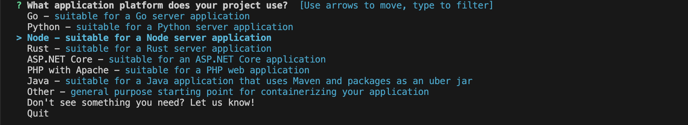

## Pull Docker Image with Digest

View docker image digest command
```
docker image ls --digests
```

Pull Nginx image with digest command
```
docker pull nginx:1.25.5@sha256:923e07a43e42f56c2143184e04ed230fa2d0d2b12875cb4604e2db7a31d4e4bf
or
docker pull nginx@sha256:923e07a43e42f56c2143184e04ed230fa2d0d2b12875cb4604e2db7a31d4e4bf
```

Inspec Nginx image
```
docker manifest inspect nginx:1.25.5
```

## Generated Dockerfile tool

[Dockerize](https://easypanel.io/dockerizer/)


## Use TTL.sh, Anonymous & ephemeral Docker image registry

[TTL.sh](https://ttl.sh)

Build image and naming in TTL.sh form (Set 2m expire)
```
docker image build --tag ttl.sh/demo:2m .
```

Push image to TTL.sh
```
docker image push ttl.sh/demo:2m
```

Pull image from TTL.sh
```
docker pull ttl.sh/demo:2m  
```

## Generate Simple Docker project with Docker init

Command
```
docker init
```

Select your application platform



Then do next steps until the end


