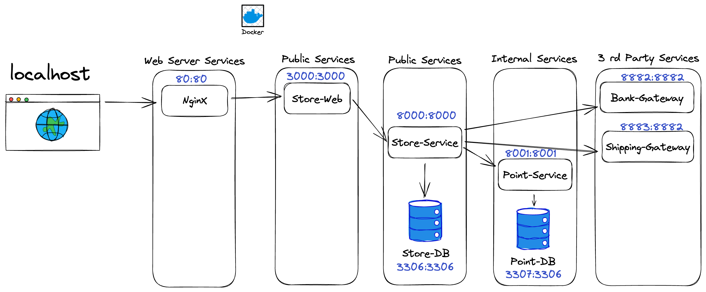

## Post test

#### ก่อนที่จะเริ่มทำให้ผู้เรียน Clone project นี้ลงมาในเครื่องคอมพิวเตอร์ของตัวเองก่อน สิ่งที่ Clone ลงมาคือ Source code ทั้งหมดของระบบ SCK-online-store

ภาพด้านล่างเป็นรูป System Architecture ระบบ SCK-online-store

สิ่งที่จะให้ผู้เรียนทำ: ใช้ Docker สร้าง Docker Containers ทดสอบระบบ Store-Service โดยใช้ Test รูปแบบ End-To-End APIs Test

1. หา System under test จากรูป System Architecture ระบบ SCK-online-store
2. เขียน Dockerfile และ Docker-compose เพื่อสร้าง Services ที่เป็น System under test ขึ้นมา
3. สร้าง End-To-End APIs Test Service ยิงไปหา System under test ที่สร้างขึ้น
4. ผลลัพธ์ที่ได้คือ Report File <ins>ถ้า report ออกมาผ่านทั้งหมดถือว่าคุณทำสำเร็จแล้วยินดีด้วย</ins>

